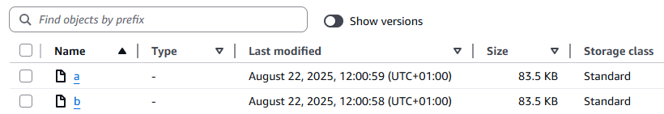
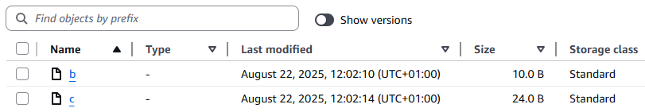
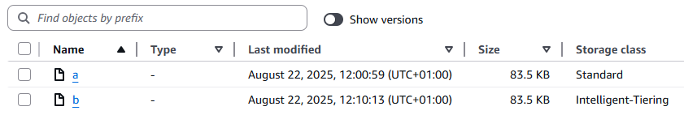

# Amazon S3 rollback tool

#### Within-bucket recovery using S3 Versioning, to a specified point-in-time, at scale.

If you want to revert lots of changes to a large dataset in Amazon S3, as quickly as possible, this tool is for you. It can detect and revert 1 million changes, in a bucket containing 10 billion objects, in under 1 hour. 

Undesired ‘soft DELETE’, ‘overwrite PUT’ and ‘fresh PUT’ operations are all in scope. Changes to storage class (by S3 Lifecycle) or to Object Tags are not in scope, as these do not create new object versions.

The tool will not delete any data - it works by adding and removing delete markers, and copying object versions where necessary, to revert a dataset to an earlier time. 

***`Note: S3 Metadata table support is coming soon.`***

## Quick start guide

Before reverting changes, you should prevent further changes taking place, for example with an update to your [bucket policy](https://docs.aws.amazon.com/AmazonS3/latest/userguide/bucket-policies.html) to deny PUT and DELETE operations by roles other than the one being used with this tool. Then deploy the [CloudFormation template](s3-rollback.yaml) in the same AWS Region as the S3 bucket you want to roll back. During deployment, specify:

1. **Bucket**: The name of the bucket to roll back.
2. **TimeStamp**: The date and time to roll back to *in the UTC timezone*, in ISO *\<yyyy-mm-dd>T\<hh:mm:ss>* format. For example: *2025-08-30T02:00:00*.
3. **Prefix**: If you want to limit recovery to a specific prefix, specify it here,  or leave blank to roll back the entire bucket. This will be used to select from available S3 Inventories, and is required if S3 Inventory is being used, unless there is an inventory report with the whole bucket in scope.
4. **Start S3 Batch Operations jobs**: The tool creates S3 Batch Operations jobs to revert changes, but by default it will *not* start the jobs. If you are working with a test dataset and do not need to validate the operations, change this to *Yes*.
5. **Copy to storage class**: The S3 storage class to copy object versions into. As always with S3, if in doubt, use Intelligent-Tiering. See [the documentation](https://docs.aws.amazon.com/AmazonS3/latest/userguide/sc-howtoset.html) for more information.
6. **Copy using KMS key (optional)**: If object versions should be created using a KMS encryption key, specify it here. Leave blank for bucket default. *Permissions to KMS keys are not updated by this tool - see the* [**KMS permissions**](#kms-permissions) *section.*
7. **Specify CSV inventory (optional)**: The S3 location of a CSV containing a current inventory of the bucket. This optional field allows you to provide a list of object versions, instead of using [S3 Inventory](https://docs.aws.amazon.com/AmazonS3/latest/userguide/storage-inventory.html). See the section [**Creating a real-time inventory using the ListObjectVersions API**](#creating-a-real-time-inventory-using-the-listobjectversions-api).

Once the CloudFormation deployment is complete, review the S3 Batch Operations Jobs and their manifests using the S3 Console, then run the jobs. If using KMS encryption, ensure the role being used with this tool has the necessary permissions before running the jobs.

There may be object versions that need to be copied to complete the recovery, but are in an asynchronous [S3 storage class](https://aws.amazon.com/s3/storage-classes/) (i.e. Glacier Flexible Retrieval or Glacier Deep Archive). This tool will not retrieve and copy these, but will output their details in a CSV manifest `scenario3a.csv`, in the S3 path referenced in the `Manifests` output, that can be used with the solution [**Guidance for Automated Restore and Copy for Amazon S3 Glacier Objects**](https://github.com/aws-solutions-library-samples/guidance-for-automated-restore-and-copy-for-amazon-s3-glacier-objects).

When you no longer need the manifests and other artifacts created by the tool, see the [Cleaning up](#cleaning-up) section.

## Background and requirements

[Amazon S3](https://aws.amazon.com/s3/) is an object storage service with industry-leading scalability, data availability, security, performance, and 99.999999999% (11 9s) of data durability. [S3 Versioning](https://docs.aws.amazon.com/AmazonS3/latest/userguide/Versioning.html) protects against accidental deletions and overwrites by keeping multiple variants of an object in the same S3 bucket, and placing a [delete marker as the current version in response to simple DELETE requests](https://docs.aws.amazon.com/AmazonS3/latest/userguide/DeletingObjectVersions.html) (i.e. without specifying a VersionID). 

To return the state of a dataset to an earlier time, this tool adds delete markers and copies desired version of objects. These desired versions of objects must still exist. Users can prevent the deletion of specific versions in Amazon S3 by denying use of the [DeleteObjectVersion](https://docs.aws.amazon.com/AmazonS3/latest/API/API_DeleteObject.html) API with [bucket policies](https://docs.aws.amazon.com/AmazonS3/latest/userguide/bucket-policies.html), [access point policies](https://docs.aws.amazon.com/AmazonS3/latest/userguide/access-points-policies.html), [service control policies (SCPs)](https://docs.aws.amazon.com/organizations/latest/userguide/orgs_manage_policies_scps.html), or [resource control policies](https://docs.aws.amazon.com/organizations/latest/userguide/orgs_manage_policies_rcps.html), and/or by using [S3 Object Lock](https://docs.aws.amazon.com/AmazonS3/latest/userguide/object-lock.html). For a complementary solution to assist with this, see [**Maintaining object immutability by automatically extending Amazon S3 Object Lock retention periods**](https://aws.amazon.com/blogs/storage/maintaining-object-immutability-by-automatically-extending-amazon-s3-object-lock-retention-periods/).

If you prefer to copy your dataset into a new bucket, as it was at a point in time, refer to [**Access a point in time with Amazon S3 Object Lambda**](https://aws.amazon.com/blogs/storage/access-a-point-in-time-with-amazon-s3-object-lambda/) - a complimentary solution which can also provide snapshot-like read-only access without copying or changing any of your objects. Althernative, conider 

Either [S3 Metadata tables](https://docs.aws.amazon.com/AmazonS3/latest/userguide/metadata-tables-overview.html) or [S3 Inventory](https://docs.aws.amazon.com/AmazonS3/latest/userguide/storage-inventory.html) is used to provide an index of the bucket to be rolled back. If S3 Metadata is configured for your bucket, this enables reverting to a point-in-time within the last day. S3 Inventory resports are eventually consistent, and might not include recently added or deleted objects. They can be created automatically either daily or weekly. The S3 Inventory must be configured to output in [Parquet or Apache ORC](https://docs.aws.amazon.com/athena/latest/ug/columnar-storage.html) format and include all versions, as well as all [additional metadata](https://docs.aws.amazon.com/AmazonS3/latest/userguide/configure-inventory.html#configure-inventory-console). It must not be stored with KMS encryption. See **Deployment workflow** for additional detail.

***`Note: S3 Metadata table support is coming soon.`***

## Rolling back changes at scale   

Users can [see the version history of a single object key in the S3 console](https://docs.aws.amazon.com/AmazonS3/latest/userguide/list-obj-version-enabled-bucket.html), and reverting a single object to an earlier version is as simple as [making a copy of the desired version to the same object key name](https://docs.aws.amazon.com/AmazonS3/latest/userguide/RestoringPreviousVersions.html), or [deleting a delete marker](https://docs.aws.amazon.com/AmazonS3/latest/userguide/ManagingDelMarkers.html). If an undesired net-new object has been placed (i.e. a ‘fresh PUT’), it can have a delete marker placed on it with a DELETE operation.

This solution enables restoration at scale, finding changes within buckets containing billions of objects in minutes (using [Amazon Athena](https://aws.amazon.com/athena/)). It then determines the most efficient operations needed to revert those changes, and creates [S3 Batch Operations](https://aws.amazon.com/s3/features/batch-operations/) jobs to enact them. *By default, these jobs are not started automatically*. Users should review the jobs and their manifests to ensure the rollback operations are desired, before proceeding to run the jobs. The jobs can be found in the S3 Batch Operations console, or the CloudFormation output.

## Scenarios covered

For each object key (name) in scope of the prefix filter:

1. **Revert DELETE operations:** At the desired point in time (tD), a regular object (not a delete marker) was current. Since tD there has been at least one DELETE operation, but no regular objects have been PUT to the key. 
    - **Action: Delete all delete markers written since tD.**
2. **Revert ‘fresh PUTs’:** Since tD, a new object has been written (and potentially overwritten by further versions). At tD, there was either no object with this name, or the current version was a delete marker. At the time of the latest inventory, the current version of the object is not a delete marker. 
    - **Action: Add a delete marker as the current version.**
3. **Revert ‘overwrite PUTs’:** At tD, a regular object (not a delete marker) was current. Since tD, there has been at least one PUT to the same key. 
    - **Action: Copy the desired version, creating a new current version.**
    - **Exception:** If the the desired version is in an an asynchronous S3 storage class (Glacier Flexible Retrieval or Glacier Deep Archive), include this in the `scenario3a.csv` manifest. You can then use [**Guidance for Automated Restore and Copy for Amazon S3 Glacier Objects**](https://github.com/aws-solutions-library-samples/guidance-for-automated-restore-and-copy-for-amazon-s3-glacier-objects) to retrieve those object versions and copy them in place.
    - **Note:** In this scenario you may prefer to permanently delete the newer object versions. Due to the potential for data loss, the tool does *not* include this capability.

## Deployment workflow

The tool requires an index of the bucket or prefix in scope. If none is available, the deployment will fail.

* If the **ObjectListCSV** field has an entry, the tool will read it from the specified S3 location. If it cannot read or process this file, the deployment will fail.
* If the above is left blank, the tool will check the S3 Metadata configuration of the selected bucket. If an S3 Metadata live inventory table is configured for the bucket, it will use this in conjunction with the journal table to calculate the latest inventory.
* Otherwise, the tool will look at the S3 Inventory configuration of the selected bucket. It evaluates the available inventories, and will use the latest S3 Inventory report that is in [Parquet or Apache ORC](https://docs.aws.amazon.com/athena/latest/ug/columnar-storage.html) format and includes all versions as well as all [additional metadata](https://docs.aws.amazon.com/AmazonS3/latest/userguide/configure-inventory.html#configure-inventory-console). If a prefix has been specified in the CloudFormation deployment, the tool will prioritize inventories matching or containing the specified prefix. If no prefix is specified, there must be a valid S3 Inventory configuration containing all objects in the bucket, or the deployment will fail.

***`Note: S3 Metadata table support is coming soon.`***

The CloudFormation template creates the following resources:

* An S3 bucket to store Athena output (known as the solution bucket), associated [AWS Glue database](https://docs.aws.amazon.com/glue/latest/dg/define-database.html) and [Athena tables](https://docs.aws.amazon.com/athena/latest/ug/creating-tables.html), plus S3 Batch Operations manifests and reports.
   - By default, new S3 buckets have Block Public Access enabled and new objects are encrypted at rest with SSE-S3.
* Lambda functions to create the above resources, determine which inventory to use, orchestrate Athena queries, create manifests in the correct formats, create S3 Batch Operations jobs, and clean up the solution bucket when the CloudFormation stack is deleted.
* IAM roles for use by the tool.

The tool outputs manifest files for S3 Batch Operations jobs, in the S3 path referenced in the `Manifests` output:

* **Scenario 1**:  Where all version of key have last_modified after the desired Point In Time (PIT), or the current version at the desired PIT was a delete marker, and current version is not a delete marker. **Add a delete marker.**
* **Scenario 2:**  Keys where there are only delete markers (no new objects) after the PIT. **These delete markers will be deleted.**
    * `scenario2-undo.csv` will also be created so that these can be recreated if needed. See [FAQ #3](#faqs).
* **Scenarios 3a, b and c:** Keys where there was an object (not a delete marker) at the PIT, and there is current version newer than at the PIT. Excludes keys covered by scenarios 1 and 2. **The desired VersionID must be copied back to the top of the top.**
    * **3a:** Desired VersionID is in GFR/GDA class and needs to be restored from async. **This tool will not copy these objects**, but output its details in the `scenario3a.csv` manifest that can be used with [**Guidance for Automated Restore and Copy for Amazon S3 Glacier Objects**](https://github.com/aws-solutions-library-samples/guidance-for-automated-restore-and-copy-for-amazon-s3-glacier-objects).
        * Note that as ListObjectVersions and S3 Metadata don't report Intelligent Tiering tier, objects versions that need to be retrieved before being copied from the opt-in Archive and Deep Archive tiers won’t be included here unless an S3 Inventory source is used. Instead they will be included in scenario 3b or 3c, and an attempt made to copy them. These copy attempts will fail with `403: InvalidObjectState` 
    * **3b:** Desired VersionID <= 5 GiB. These objects can copied with the CopyObject API, with an S3 Batch Operations Copy job.
    * **3c:** Desired VersionID > 5 GiB. These objects require special handling. A separate S3 Batch Operations Lambda job will perform these copies, reusing code from the solution at https://aws.amazon.com/blogs/storage/copying-objects-greater-than-5-gb-with-amazon-s3-batch-operations/ .
            

## Reviewing Batch Operations reports

All S3 Batch Operations jobs created by this tool report completion reports, including both success and failure for each task. If you find you have some failures and wish to manually address these (as opposed to re-running the tool), follow the [instructions in this article](https://repost.aws/articles/ARq3WkGPYmSmiT3xC8Me_mvA/querying-s3-batch-operations-completion-reports-with-amazon-athena) to find the failures.

## Creating a real-time inventory using the ListObjectVersions API

The S3 rollback tool has been designed for use at scale (up to 10 billion objects in scope). At this scale, S3 Inventory or S3 Metadata inventory tables are necessary in order to obtain a listing of all the object versions and their details.

If you have a relatively small number of objects in your bucket, or are looking to perform rapid iterative testing of this tool, you may prefer to list all the objects in scope rather than use S3 Inventory or S3 Metadata. The example script provided at https://github.com/aws-samples/sample-s3-listobjectversions-to-csv/ uses [list_object_versions with boto3](https://boto3.amazonaws.com/v1/documentation/api/latest/reference/services/s3/client/list_object_versions.html) to output all object versions in a bucket (and optionally prefix), into a CSV format that can be used with this tool. The example script has been tested with 3 million object versions in scope, completing output of a 432 MiB file in 15 minutes (on a t2.micro instance), and with 50 million in scope, outputting approximately 7 GiB in 5 hours.

## Simple demo

For a simple demonstration example, costing around $0.75 (for the three S3 Batch Operations jobs), perform the following:

1. Create a new S3 bucket for testing, with versioning enabled. Keep all other defaults.
2. Upload objects `a` and `b`. **This is your desired (good) state**. Note the time, adjusted to the UTC timezone.
   - The bucket will look like this in the console:
   
   

   - And like this with **Show versions** enabled:
   
   .png)

3. Delete object `a`, overwrite object `b`, and write new object `c`. **This is your undesired state, that you want to roll back**.
   - The bucket will look like this in the console: 
   
   

   - And like this with **Show versions** enabled:
   
   .png)

4. Create a real-time inventory (see [Creating a real-time inventory using the ListObjectVersions API](#creating-a-real-time-inventory-using-the-listobjectversions-api)), and copy the output CSV into S3 into an otherwise empty '[folder](https://docs.aws.amazon.com/AmazonS3/latest/userguide/using-folders.html)' (prefix ending in `/`).
5. Deploy the [CloudFormation template](s3-rollback.yaml).
   - Enter the name of the test bucket you just created.
   - Enter a timestamp (in UTC) after step 2 but before step 3. In this example, it was 2025-08-22T11:01:00 .
   - Set **Start S3 Batch Operations jobs** to `YES`.
   - Set **Specify CSV inventory** to the URI of the S3 'folder' you uploaded the real-time inventory CSV file to.
   - **Create Stack**.
6. Observe the CloudFormation template deployment. When complete, observe the S3 Batch Operations jobs referenced in the output. The whole process should complete around 2 minutes.
   - The bucket will look like this in the console - back to your desired state: 
   
   

   - And like this with **Show versions** enabled:
   
   .png)

   - Note that the newest version of object `b` is a copy of the oldest version. 

## KMS permissions

The roles created by this tool **will not have IAM or KMS permissions to any KMS keys**. If you have have objects in scope that are encrypted with KMS, or you have specified that the solution should use a KMS key when copying objects, or your bucket has default encryption set to a KMS key, you will need to update permissions before starting the Batch Operations copy jobs (Scenario 3). The ARNs that require permissions are shown in the `CopyRole3b` and `CopyRole3c` output of the CloudFormation script.

Permissions required:
- KMS decrypt for object versions to be copied
- KMS encrypt for the key you selected copies to be encrypted with (or the bucket default)

## Lambda concurrency reservations

This tool will not assign reserved concurrency to Lambda operations, and may consume all avaiable Lambda concurrency. If you have concerns about this, review the S3 Batch Operations tasks that use Lambda, and adjust accordingly before running the jobs [`Tom Bailey to write a more detailed note on this`]

## FAQs

1. What did I need to have in place prior to an event that I want to recover from, in order to use this tool?
    - S3 Versioning must have been enabled before the time of the event. Object versions cannot be recovered if they have since been permanently deleted (either directly or by a lifecycle rule).
    - If you have used S3 Replication to make a copy of your data in another bucket, you could use this tool on either bucket.
    - If S3 Metadata live inventory tables are not currently enabled, or you don’t have an S3 Inventory from after the event, you will need to enable one of these and wait for it to create an inventory of your S3 bucket. Or, if you have a relatively small number of objects in your bucket, you can create an inventory CSV input to use with this tool - see [**Creating a real-time inventory using the ListObjectVersions API**](#creating-a-real-time-inventory-using-the-listobjectversions-api).
2. What about changes that took place after the inventory was created, or after the rollback process was started?
    - This tool will take the appropriate action to revert changes, based on the available inventory information at the time of deployment. The impact of a subsequent change depends on its nature, and whether it took place before or after the specific S3 Batch Operations job (created  by this rollback tool) took its action. However, in all cases, running the rollback tool *again*, with an inventory that includes new changes, will correctly revert the new changes. Note: If the new inventory includes copies made by this tool (scenario 3), those copies will be repeated as it isn't possible to tell from an inventory that the current object version's data is identical to the desired version.
3. I used this tool to roll back my bucket, and want to undo the changes. Can I do that?
    - Yes, provided you have not yet deleted the CloudFormation stack from the original deployment. This is a 2-step process:
      1. Once you have an inventory that includes the changes made by this tool, deploy the tool again to roll back to the point in time just prior to the initial deployment. If you have S3 Metadata inventory enabled, simply wait 15 minutes to ensure all changes have been written to the journal. 
      2. Once the above is complete, you need to re-create any delete markers created by the original deployment, as the updated inventory has no knowledge of these. To do this, create an S3 Batch Operations job, choose the CSV manifest `scenario2-undo.csv` from the *original deployment*, leaving **Manifest includes version IDs** unchecked. Choose **Invoke AWS Lambda function** as the operation type, the function titled `<original stack name>-S3BatchOpsDeleteFunction-<unique-id>` (you can find this name in the **Resources** output of the deployment) and **Invocation schema version 2.0**. Run the job with the role titled `<original stack name>-S3BatchOpsExecutorRole--<unique-id>`.
4. What happens when I delete the CloudFormation stack?
    - Any S3 Batch Operations jobs not in COMPLETE state will be cancelled.
    - All created resources will be deleted, including the temporary S3 and S3 Tables buckets.
5. I don’t want to delete delete markers, but instead copy the desired object version to the top of the version stack.
    - As this increases both cost and time, delete markers contain no data, and deletion of delete markers is reversible, we made the decision not to prioritize providing this as an option. We may consider adding this capability based on feedback - see [Issues](https://github.com/aws-samples/sample-s3-rollback-tool/issues).
6. I have [ACLs enabled](https://docs.aws.amazon.com/AmazonS3/latest/userguide/ensure-object-ownership.html) on my bucket, can I still use this tool?
    - Yes, however the copy operations carried out by this tool will overwrite the ownerID, which may cause access issues for the original uploading account.

## Charges

The charges for deploying this solution are minimal. S3 Batch Operations charges per object as well as per job. Rollback COPY requests incur the usual S3 charges, while DELETE requests have no cost other than for the Lambda compute to initiate them. Amazon Athena charges scale with the number of objects in scope.

For example, if you use this tool against an entire bucket in us-east-1 containing 1 billion objects, and with an existing Amazon S3 Inventory, to roll back 1 million fresh PUTs, 1 million overwrite PUTs and 1 million DELETEs since the desired point-in-time, **the total cost would be approximately $12** ($1 Athena, $5 S3 PUTs, $4 S3 Batch Operations, $2 lambda).

Amazon S3 pricing is available at [https://aws.amazon.com/s3/pricing](https://aws.amazon.com/s3/pricing/).

## Cleaning up

As the tool is deployed once per use, it should be removed once the jobs are complete and the reports are no longer required.

To do this, delete the CloudFormation stack. This will delete any CSV manifests generated by the tool, as well as all the resources it created.

## Tenets

* **Works at any scale**: Designed to support 10B object buckets with 1B changes. Efficiency is key to achieving this. Re-running with a new index (to catch up, or following failures/cancellations) will not repeat completed operations (where possible, see FAQ 2).
* **Fast at any scale:** Revert 1M changes in a 10B object bucket in under 1 hour, end to end, using S3 Inventory. Revert a few thousand changes in a bucket with a few hundred objects in under 10 minutes, including real-time inventory CSV creation.
* **Do no harm:** Do not delete data (never regular object versions, only delete markers). BOPS jobs are created but not started by default.
* **Flexible**: Use any index. Give users control of prefix or regex, and which operations to carry out. 
* **No assumptions**: Don’t assume which operations the user wants to run, which storage class to copy to, or encryption to use for copies. We can’t know what’s ‘correct’, so we ask.

## Additional resources

* [AWS CloudFormation product page](https://aws.amazon.com/cloudformation/)
* [Amazon S3 Batch Operations documentation](https://docs.aws.amazon.com/AmazonS3/latest/userguide/batch-ops.html)
* [AWS Lambda product page](https://aws.amazon.com/lambda/)
* [AWS Lambda Performance Guidelines](https://docs.aws.amazon.com/lambda/latest/operatorguide/perf-optimize.html)
* [Serverless Data Integration – AWS Glue – Amazon Web Services](https://aws.amazon.com/glue/)
* [Interactive SQL - Serverless Query Service - Amazon Athena - AWS](https://aws.amazon.com/athena/)
* [Amazon S3 Inventory](https://docs.aws.amazon.com/AmazonS3/latest/userguide/storage-inventory.html)
* [Amazon S3 Metadata tables](https://docs.aws.amazon.com/AmazonS3/latest/userguide/metadata-tables-overview.html)
* [Amazon S3 Tables](https://docs.aws.amazon.com/AmazonS3/latest/userguide/s3-tables.html)

## Contributing

See [CONTRIBUTING](CONTRIBUTING.md) for more information.

## License

This library is licensed under the MIT-0 License. See the [LICENSE](license) file.
