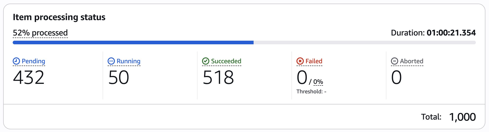

# Running against multiple buckets with s3-rollback-orchestrator.yaml

The `s3-rollback-orchestrator.yaml` CloudFormation template drives the [S3 rollback tool](readme.md) across many buckets in a single account and region. It reads an input CSV from Amazon S3 and deploys one child CloudFormation stack per row using [`s3-rollback.yaml`](s3-rollback.yaml), applying the same timestamp and execution mode to each. To keep IAM role count manageable at scale, the orchestrator can create a single shared IAM role that all child stacks use instead of each creating their own.

Use it when you need to revert or recreate datasets in many buckets from the same point in time, without deploying the rollback template manually for each one.

## Table of Contents

- [When to use the orchestrator](#when-to-use-the-orchestrator)
- [How it works](#how-it-works)
- [Prerequisites](#prerequisites)
- [Input CSV format](#input-csv-format)
- [Parameters](#parameters)
- [Deploying](#deploying)
- [Monitoring progress](#monitoring-progress)
  - [Step Functions console (best overall view)](#step-functions-console-best-overall-view)
  - [CloudFormation console (per-stack status)](#cloudformation-console-per-stack-status)
  - [S3 Batch Operations console (rollback execution)](#s3-batch-operations-console-rollback-execution)
  - [CloudWatch Logs (debugging)](#cloudwatch-logs-debugging)
- [Results CSV](#results-csv)
- [Reviewing and running the S3 Batch Operations jobs](#reviewing-and-running-the-s3-batch-operations-jobs)
- [Status values](#status-values)
- [Failure notifications](#failure-notifications)
- [Cleanup](#cleanup)
- [Limitations](#limitations)
- [Working within AWS service limits](#working-within-aws-service-limits)
  - [IAM role count](#iam-role-count)
  - [Lake Formation data lake admins](#lake-formation-data-lake-admins)
  - [Athena WorkGroup quota](#athena-workgroup-quota)
  - [Step Functions history and payload limits](#step-functions-history-and-payload-limits)
  - [Concurrency and stagger (CloudFormation, Athena, S3 Batch Operations)](#concurrency-and-stagger-cloudformation-athena-s3-batch-operations)

## When to use the orchestrator

Use the orchestrator if all of the following are true:
- You want to roll back multiple buckets in the same AWS account and region.
- A single [timestamp](readme.md#deploying-and-running-the-guidance) and a single [execution mode](readme.md#scenarios-covered) (`Bucket Rollback` or `Delete Marker Removal`) apply to every bucket in scope.
- Each bucket satisfies the [prerequisites](readme.md#prerequisites) for `s3-rollback.yaml` (S3 Versioning enabled, inventory available, etc.).

If you only have one bucket to recover, deploy [`s3-rollback.yaml`](s3-rollback.yaml) directly. If you need to combine different timestamps or modes, run the orchestrator multiple times with different input CSVs.

## How it works

The orchestrator stack creates an AWS Step Functions state machine plus supporting Lambda functions and IAM roles. When the stack finishes deploying, it starts a single state machine execution that:

1. Reads the input CSV from S3 and validates each row (bucket name format, deduplication on `bucket/prefix`). Each row is assigned a small start delay to stagger launches across the first wave.
2. For each valid row, using a [Distributed Map](https://docs.aws.amazon.com/step-functions/latest/dg/concepts-asl-use-map-state-distributed.html) with a maximum concurrency of 50 — each row runs as its own STANDARD child execution:
   1. Waits its assigned stagger delay (0–135 seconds), then checks that the bucket exists and that no active `s3-rollback-<bucket>-*` stack created by **this orchestrator deployment** already covers the same bucket and prefix combination. Stacks from prior runs or parallel orchestrator deployments are not treated as duplicates.
   2. Creates a child stack named `s3-rollback-<bucket>-<prefix-slug>-<random-hex>` (or `s3-rollback-<bucket>-<random-hex>` when no prefix is specified) from the `s3-rollback.yaml` template you staged in S3, passing the shared timestamp, mode, and per-row prefix and KMS key.
   3. Polls the child stack every 30 seconds for up to 120 iterations (~60 minutes). If the stack is still `*_IN_PROGRESS` at the timeout, the orchestrator issues a delete and the child execution fails with error `TIMEOUT`. Any CFN deployment failure (`ROLLBACK_COMPLETE`, `CREATE_FAILED`, etc.) also fails the child execution, making it visible in the map run Failed count.
3. Writes per-row results to `s3://<ResultsBucket>/intermediate/<execution-name>/` as child executions complete, then consolidates them into a results CSV at `s3://<ResultsBucket>/results/orchestrator-results-<timestamp>.csv`.

The child stacks are standard `s3-rollback.yaml` deployments. Each creates its own temporary S3 bucket for Athena query results, manifests, and S3 Batch Operations reports.

## Prerequisites

In addition to the [rollback tool prerequisites](readme.md#prerequisites) for every bucket in scope:

1. **Stage `s3-rollback.yaml` in S3.** Upload the `s3-rollback.yaml` template from this repository to an S3 bucket you control. The orchestrator references it by HTTPS URL (for example, `https://my-templates.s3.us-east-1.amazonaws.com/s3-rollback.yaml`). Make sure the URL is readable by CloudFormation in the account and region where you deploy the orchestrator.
2. **Results bucket.** Create or identify a single S3 bucket to receive the orchestrator results CSV. It must be in the same region as the orchestrator stack. Each child stack creates its own temporary bucket for its manifests, Athena output, and S3 Batch Operations reports, so only the orchestrator's results CSV is written here.
3. **Input CSV in S3.** Upload a CSV listing the buckets to process (see [Input CSV format](#input-csv-format)).
4. **Deploying principal permissions.** The IAM principal deploying the orchestrator stack needs standard CloudFormation and IAM permissions to create the orchestrator resources. In LF-mode accounts, `lakeformation:PutDataLakeSettings` and `lakeformation:GetDataLakeSettings` are also required, for the same reasons as with `s3-rollback.yaml` (see [Prerequisites](readme.md#prerequisites)). The orchestrator's `LambdaExecutionRole` handles all downstream actions and is scoped to the `s3-rollback-*` naming convention.
5. **Lake Formation.** If any target bucket uses S3 Metadata integration configured before approximately March 17, 2026, the same [Lake Formation prerequisites](readme.md#prerequisites) apply as with `s3-rollback.yaml`. The orchestrator's Lambda role has `lakeformation:PutDataLakeSettings` and `lakeformation:GetDataLakeSettings`, and child stacks perform LF grants as needed.

## Input CSV format

Columns (positional):

| Column | Required | Description |
|---|---|---|
| Bucket Name | Yes | Name of the bucket to roll back or copy from. Must match the standard S3 bucket naming pattern. |
| Prefix | No | Prefix to scope rollback to, or blank for the whole bucket. Passed through to `s3-rollback.yaml` unchanged. Multiple prefixes may be supplied as a comma-separated list, in which case the orchestrator creates one child stack per prefix for the same bucket. **Prefixes that contain a literal comma are not supported** — the orchestrator always splits the prefix field on commas. |
| KMS Key | No | ARN or key ID of the customer managed KMS key used to encrypt the bucket's S3 Metadata tables (journal and inventory). Required only if the metadata tables were configured with a CMK — leave blank if they use the default SSE-S3 encryption. Maps to `ExistingKmsKeyIdOrArn` in `s3-rollback.yaml`. |

The header row is optional. The parser treats the first row as data unless the first column value does not match the bucket-name pattern, in which case it's skipped as a header.

Example `buckets.csv` (see also [`example-buckets.csv`](example-buckets.csv) in this repository):

```csv
Bucket Name,Prefix,KMS Key
my-data-bucket,,
my-reports-bucket,year=2026/,
my-secrets-bucket,,arn:aws:kms:us-east-1:123456789012:key/0123abcd-4567-89ef-abcd-ef0123456789
my-multi-prefix-bucket,"team-a/,team-b/,team-c/",
```

The last row produces three child stacks — one per prefix — for the same bucket.

Rows are skipped (reported as `SKIPPED` in the results CSV) if any of the following apply:
- The bucket name is missing or doesn't match the S3 bucket-name pattern.
- The bucket does not exist or is not reachable from the deploying account.
- The same `bucket/prefix` combination appears earlier in the CSV.
- An active `s3-rollback-<bucket>-*` CloudFormation stack already exists for that bucket (reported as `EXISTING` with the existing stack name, not re-created).

Upload the CSV to S3 and note the URL. Both `s3://` and `https://` formats are accepted, and the URL must end in `.csv`.

## Parameters

| Parameter | Required | Description |
|---|---|---|
| **Buckets to roll back** (`S3CsvUrl`) | Yes | S3 URL of the input CSV (`s3://bucket/key.csv` or an equivalent `https://` URL). |
| **Rollback Template S3 URL** (`TemplateS3Url`) | Yes | HTTPS URL of `s3-rollback.yaml` staged in S3. Must end in `.yaml`. |
| **Results Bucket** (`ResultsBucket`) | Yes | S3 bucket name where the orchestrator writes its results CSV under `results/`. Each child stack creates its own temporary bucket for manifests, Athena output, and Batch Operations reports. |
| **Rollback Timestamp** (`TimeStamp`) | Yes | Point-in-time in UTC ISO format `yyyy-mm-ddThh:mm:ss`. Applied to every child stack. |
| **Execution Mode** (`Mode`) | Yes | One of `Bucket Rollback` or `Delete Marker Removal`. Default: `Delete Marker Removal`. `Copy to Bucket` is not supported — see [Limitations](#limitations). See [Scenarios covered](readme.md#scenarios-covered). |
| **Start S3 Batch Operations Jobs** (`StartS3BatchOperationsJobs`) | No | `YES` to start the Batch Operations jobs automatically in each child stack, `NO` (default) to leave them paused for review. |
| **Create Shared IAM Role** (`CreateSharedIAMRole`) | No | `YES` (default) to create one IAM role shared by all child stacks. `NO` means each child stack creates its own roles. Ignored if `SharedIAMRoleArn` is set. |
| **Shared IAM Role ARN (existing)** (`SharedIAMRoleArn`) | No | ARN of an existing IAM role for all child stacks to use. Takes precedence over `CreateSharedIAMRole`. |
| **SNS email list** (`SNSEmailList`) | No | Comma-separated list of email addresses. When provided, the orchestrator creates an SNS topic and subscribes each address, then publishes a notification whenever the orchestrator or cleanup state machine ends in `FAILED`, `TIMED_OUT`, or `ABORTED`. Leave blank to skip. See [Failure notifications](#failure-notifications). |

### Shared IAM role

By default, each child stack creates its own IAM roles. At scale this can approach the IAM role quota. You have two alternatives:

- Set `CreateSharedIAMRole` to `YES` to have the orchestrator create a single role (`<orchestrator-stack>-child-execution-role`) that all child stacks reuse. The role is trusted by `lambda.amazonaws.com` and `batchoperations.s3.amazonaws.com` and has the permissions needed for inventory detection, Athena queries, S3 data-plane operations, and KMS key policy updates. It is deleted when the orchestrator stack is deleted.
- Set `SharedIAMRoleArn` to the ARN of a role you manage yourself. This role must match the trust policy and permissions shape of the role created by `CreateSharedIAMRole`. Using a pre-existing role is useful when you want to reuse a role across multiple orchestrator runs or manage it outside CloudFormation.

If both are provided, `SharedIAMRoleArn` wins.

## Deploying

1. Upload `s3-rollback.yaml` to an S3 bucket and note its HTTPS URL.
2. Upload your input CSV to S3 and note its URL.
3. In the AWS Management Console, in the region you want to operate in, open CloudFormation and choose **Create stack** → **With new resources (standard)**.
4. Choose **Upload a template file**, select `s3-rollback-orchestrator.yaml`, and choose **Next**.
5. Enter a stack name and the parameters above, then choose **Next**.
6. On **Configure stack options**, scroll to the end, check the box acknowledging IAM resource creation, and choose **Next**.
7. Review and choose **Submit**.

Once the orchestrator stack reaches `CREATE_COMPLETE`, a Step Functions execution starts automatically. Find it in the Step Functions console under the state machine `<stack-name>-orchestrator`. Each child stack appears in the CloudFormation console as `s3-rollback-<bucket>-<prefix-slug>-<hex>` (or `s3-rollback-<bucket>-<hex>` when no prefix is specified).

To run the orchestrator again without tearing down the stack, start a new execution of the same state machine with an input of:

```json
{
  "S3CsvUrl": "s3://my-templates/buckets.csv",
  "ResultsBucket": "my-rollback-results",
  "StartS3BatchOperationsJobs": "NO",
  "TimeStamp": "2026-05-08T02:00:00",
  "Mode": "Delete Marker Removal"
}
```

## Monitoring progress

### Step Functions console (best overall view)

Open the [Step Functions console](https://console.aws.amazon.com/states/home) and find the state machine named `<stack-name>-orchestrator`. Click the most recent execution. The execution graph shows:

- **ParseCSV** — completes in seconds once the input CSV is read.
- **MapOverRows (Map)** — a Distributed Map that launches one STANDARD child execution per CSV row, up to 50 running in parallel. The Map state shows aggregate counts (e.g. "120 Succeeded, 10 Running, 870 Pending, 0 Failed"). Click **Map run** to open the map run detail view.
- **GenerateResults** — reads the per-row results from S3 and writes the consolidated results CSV; only runs after all child executions complete.

The **map run detail view** is the most useful screen during a long run. It shows:
- Live aggregate counts: Succeeded, Running, Pending, Failed, Timed Out.
- A list of every child execution. Each child execution name is a UUID — click one to open its full state graph, inputs, and outputs. The bucket name and prefix are in the child execution's input under `Row.BucketName` and `Row.Prefix`.



Because each row runs as its own child execution, the parent execution history stays small regardless of row count. Failed child executions are visible directly in the map run list — click one to see exactly which state failed and why.

### CloudFormation console (per-stack status)

Filter the CloudFormation stacks list by `s3-rollback-` to see all child stacks. Each is named `s3-rollback-<bucket>-<prefix-slug>-<hex>` (or `s3-rollback-<bucket>-<hex>` when no prefix is specified), so both the bucket name and prefix are visible directly in the stack list without clicking into anything. The **Status** column updates in real time as each child stack deploys.

When a child stack reaches `CREATE_COMPLETE`, its S3 Batch Operations jobs have been created (and started, if `StartS3BatchOperationsJobs` is `YES`). If a stack shows `ROLLBACK_COMPLETE` or `CREATE_FAILED`, click the stack and open the **Events** tab to see the root cause.

### S3 Batch Operations console (rollback execution)

Each child stack creates one or more S3 Batch Operations jobs. If `StartS3BatchOperationsJobs` is `YES`, the jobs start automatically and you can track them in the [S3 Batch Operations console](https://console.aws.amazon.com/s3/jobs). Filter by the child stack name prefix or check the `Manifests` output of each child stack for the exact job IDs.

Each job shows:
- **Status** — `Active`, `Complete`, `Failed`, or `Cancelled`.
- **Progress** — objects succeeded, failed, and total, updated in real time.
- **Completion report** — written to the child stack's temporary S3 bucket when the job finishes. The report lists any per-object failures with their error codes.

> **Note:** [S3 Batch Operations allows a maximum of 6 jobs in `Active` status per account at a time](https://docs.aws.amazon.com/AmazonS3/latest/userguide/batch-ops.html). When running the orchestrator against many buckets, jobs beyond that limit will sit in `Ready` status and start automatically as active slots become available. No action is needed — this is expected behaviour.

If `StartS3BatchOperationsJobs` is `NO` (the default), the jobs are created in `Suspended` state. You start them manually after reviewing the manifests — see [Reviewing and running the S3 Batch Operations jobs](#reviewing-and-running-the-s3-batch-operations-jobs).

### CloudWatch Logs (debugging)

The orchestrator Lambda functions write to log groups under `/aws/lambda/<stack-name>-`:

| Log group suffix | What it logs |
|---|---|
| `csv-parser` | CSV parsing, row validation, skip reasons |
| `stack-manager` | One line per create/poll/error event, keyed by `bucket=<name>` — filter by bucket name to track a specific bucket |
| `results-writer` | Results CSV key written to S3 |

The `stack-manager` log format is designed to be filterable. Each line starts with a keyword and includes `bucket=<name>` and `stack=<name>`, for example:

```
CREATED  bucket=my-data-bucket  stack=s3-rollback-my-data-bucket-3f9a12
POLL     bucket=my-data-bucket  stack=s3-rollback-my-data-bucket-3f9a12  status=CREATE_IN_PROGRESS
POLL     bucket=my-data-bucket  stack=s3-rollback-my-data-bucket-3f9a12  status=CREATE_COMPLETE
FAILED   bucket=my-reports-bucket  stack=s3-rollback-my-reports-bucket-year-2026--7c2e44  status=ROLLBACK_FAILED  reason=...
```

To filter by bucket name in the CloudWatch Logs console, open the log group and use the filter pattern `bucket=my-data-bucket`. To see only failures across all buckets, filter for `FAILED`.

Child stack Lambda functions write to their own log groups under `/aws/lambda/s3-rollback-<bucket>-<hex>-*`. These are the most useful logs when a child stack's Athena queries or S3 Batch Operations job creation fails.

## Results CSV

When the state machine completes, the results CSV is written to:

```
s3://<ResultsBucket>/results/orchestrator-results-<yyyymmdd-hhmmss-uuuuuu>.csv
```

Columns: `Bucket Name`, `Prefix`, `TimeStamp`, `KMS Key`, `Stack Name`, `Stack Status`, `Error`.

As child executions complete, their outputs are written incrementally to `s3://<ResultsBucket>/intermediate/<execution-name>/` by the Distributed Map's `ResultWriter`. Succeeded child executions write their result directly; failed child executions (CFN deployment failures, timeouts, poll errors) are captured in separate result files and synthesised into equivalent rows. The `GenerateResults` step reads all result files to produce the final CSV — every input row appears in the output regardless of outcome. The intermediate files are not deleted automatically — see [Cleanup](#cleanup).

If the state machine fails part way through (for example, a Lambda service exception), a partial results CSV is still written with whatever rows completed before the failure.

## Reviewing and running the S3 Batch Operations jobs

By default, `StartS3BatchOperationsJobs` is `NO` and each child stack leaves its S3 Batch Operations jobs paused. You should:

1. Inspect the results CSV and identify child stacks with status `CREATE_COMPLETE`.
2. For each child stack, open the CloudFormation stack in the console and review the `Manifests` output and the S3 Batch Operations jobs listed in the stack outputs.
3. If your buckets use KMS encryption, grant the roles in each child stack the KMS permissions described in [KMS permissions](readme.md#kms-permissions) before starting copy jobs.
4. Review [AWS Lambda concurrency reservations](readme.md#aws-lambda-concurrency-reservations) if running in a production account. The child stacks do not reserve concurrency by default.
5. When you are ready, run the S3 Batch Operations jobs in each child stack.

The [Mode comparison](readme.md#mode-comparison) and per-mode scenario details in the main readme apply to every child stack.

## Status values

Values that can appear in the `Stack Status` column of the results CSV:

| Status | Meaning |
|---|---|
| `CREATE_COMPLETE` | Child stack deployed successfully. S3 Batch Operations jobs are in the state determined by `StartS3BatchOperationsJobs`. |
| `CREATE_FAILED` | Child stack creation failed. See `Error` column and the CloudFormation events for details. |
| `ROLLBACK_COMPLETE` | Child stack failed and was rolled back by CloudFormation. |
| `ROLLBACK_FAILED` | Child stack failed and rollback also failed. Manual cleanup may be needed. |
| `SKIPPED` | Row was skipped before a child stack was created (invalid bucket name, duplicate, missing bucket, or other validation failure). |
| `EXISTING` | An active `s3-rollback-<bucket>-*` stack created by this orchestrator deployment was already present for the same bucket and prefix. The orchestrator did not create a new one. |
| `TIMEOUT` | Stack creation did not complete within ~60 minutes. The orchestrator issued a delete on the stack. |
| `POLL_ERROR` | `DescribeStacks` failed during polling. The stack may still be progressing — check it in CloudFormation directly. |

`CREATE_COMPLETE`, `SKIPPED`, and `EXISTING` are successful child executions. All other statuses are failed child executions and appear in the **Failed** count in the map run detail view.

## Failure notifications

To receive an email if the orchestrator or cleanup state machine ends in failure, set `SNSEmailList` at deploy time to a comma-separated list of recipients, for example `admin@example.com,security@example.com`.

When the parameter is non-empty, the orchestrator stack creates:

- An SNS topic named `<orchestrator-stack>-failure-notifications`.
- One email subscription per address in the list. Each recipient gets the standard SNS confirmation email and must click the confirmation link before notifications are delivered.
- Two EventBridge rules — one per state machine — that publish to the topic when an execution ends with `FAILED`, `TIMED_OUT`, or `ABORTED`. Both the main orchestrator state machine and the cleanup state machine are covered.

The notification body includes the execution ARN, status, and start/stop times. Open the linked execution in the Step Functions console to see exactly which state failed.

Notifications are not sent for individual child execution or child stack failures. Those are visible in the map run detail view and the results CSV. The SNS topic only fires when the parent state machine itself terminates abnormally — for example, a Lambda service error, a state machine timeout, or a cleanup state machine that can't delete a stuck child stack.

To add or remove subscribers after deploy, either update the stack with a new `SNSEmailList` value or manage subscriptions directly on the topic in the SNS console.

The SNS topic ARN is not exposed as a stack output. If you need it programmatically, look up the topic name `<orchestrator-stack>-failure-notifications` in the SNS console or via `aws sns list-topics`.

## Cleanup

Deleting the orchestrator stack cleans up everything it created:

- **Child stacks** — a cleanup state machine runs during orchestrator stack deletion and deletes all child stacks tagged with this orchestrator's stack ID. It first stops any running orchestrator executions so the Distributed Map cannot create new child stacks mid-cleanup, then deletes child stacks in parallel (up to 50 concurrent) and waits for each to reach `DELETE_COMPLETE`. The shared IAM role and other orchestrator resources are kept alive until cleanup finishes (via `DependsOn`), so child stacks always have working roles. If any child stack reaches `DELETE_FAILED`, the cleanup state machine fails and the orchestrator stack delete fails too — no resources are silently retained. Each successful child stack deletion removes its temporary S3 bucket, manifests, `scenario*_undo.csv` files, and Athena WorkGroup.
- **Orchestrator resources** — the state machine, Lambda functions, shared IAM role (if created), shared Athena WorkGroup pool, and CloudWatch log group are all removed with the orchestrator stack.
- **Not removed** — the results CSV and `intermediate/` prefix in the results bucket are retained. Delete them manually if no longer needed.

**Scale limit.** The cleanup state machine handles up to approximately 750 child stacks reliably within the 900s trigger Lambda timeout. For larger deployments, split the input CSV across two orchestrator stacks running in parallel. If the cleanup state machine fails (for example, a child stack is genuinely stuck), the orchestrator stack delete fails too — by design, so you don't end up with orphaned resources. Inspect the cleanup state machine execution to see which child stack failed and which resources got stuck, fix the underlying issue, and re-delete the orchestrator stack.

## Limitations

- All child stacks share one `TimeStamp`, one `Mode`, and one `StartS3BatchOperationsJobs` value. If you need these to vary per bucket, run the orchestrator multiple times with different input CSVs.
- The orchestrator references `s3-rollback.yaml` only. It does not deploy [`s3-rollback-glue-metadata.yaml`](readme.md#large-scale-template-s3-rollback-glue-metadatayaml) child stacks. For buckets with more than ~3 billion objects in scope, deploy `s3-rollback-glue-metadata.yaml` directly.
- The **Specify CSV inventory** parameter is not exposed by the orchestrator. Each bucket must have [S3 Metadata](https://docs.aws.amazon.com/AmazonS3/latest/userguide/metadata-tables-overview.html) or a valid [S3 Inventory](https://docs.aws.amazon.com/AmazonS3/latest/userguide/storage-inventory.html) configured. To use a manually provided CSV inventory, deploy `s3-rollback.yaml` directly for that bucket.
- Mode `Copy to Bucket` is not supported. Each Copy to Bucket operation needs its own destination bucket, and the orchestrator has no way to vary it per row. To recreate a point-in-time into a separate bucket, deploy `s3-rollback.yaml` directly for each source bucket.
- Prefixes containing a literal comma are not supported. The orchestrator always splits the prefix field on commas, so a prefix like `data,backup/` would be treated as two separate prefixes (`data` and `backup/`) regardless of CSV quoting.
- Map concurrency is capped at 50 child stacks in flight. This limits the load on CloudFormation, Athena, and S3 Batch Operations. See [Concurrency and stagger](#concurrency-and-stagger-cloudformation-athena-s3-batch-operations).
- Polling is capped at ~60 minutes **per child stack** (120 × 30-second intervals). A child stack still in progress at that point is deleted and marked `TIMEOUT`. With `MaxConcurrency: 50` and typical child stack durations of 5–10 minutes, a 1,000-row run completes in roughly 30–60 minutes. There is no cap on total execution time.
- Cross-account rollback is not supported from a single orchestrator run. Each orchestrator stack operates within its own account and region.
- **Cleanup scale limit.** The cleanup state machine reliably handles up to approximately 750 child stacks within the 900s trigger Lambda timeout. For larger deployments, split the input CSV across two orchestrator stacks running in parallel. See [Cleanup](#cleanup).

## Working within AWS service limits

Running a stack per bucket at scale touches several AWS service limits. The orchestrator is designed to stay comfortably within each of them.

### IAM role count

Each child `s3-rollback.yaml` stack normally creates several IAM roles (Lambda execution, S3 Batch Operations). At a few hundred buckets per run, this approaches the default IAM role quota for an account. The `CreateSharedIAMRole` / `SharedIAMRoleArn` parameters collapse those per-child roles into a single role that every child stack reuses. See [Shared IAM role](#shared-iam-role).

### Lake Formation data lake admins

In Lake Formation-mode accounts, granting LF permissions from a child stack requires the granting principal to be an LF data lake admin. The naive approach — each child stack elevates its own role to LF admin — has two problems:

- LF enforces a per-account cap on the number of data lake admins.
- `PutDataLakeSettings` is not safe under concurrency. Multiple child stacks racing to append themselves surfaces as `ConcurrentModificationException`.

The orchestrator elevates its own `LambdaExecutionRole` to LF admin once, via `AWS::LakeFormation::DataLakeSettings` with `MutationType: APPEND`. It then passes that role ARN to each child stack as `LFAdminRoleArn`. Children use it to perform their grants without touching the admin list themselves, so the list stays small and the race disappears.

### Athena WorkGroup quota

Each child `s3-rollback.yaml` stack normally creates an Athena WorkGroup for its queries. The default per-account quota is 1,000 WorkGroups per region. At scale, a run of several hundred buckets can exhaust this quota, causing new child stacks to fail at the `AthenaWorkGroup` resource.

The orchestrator avoids this by pre-creating a fixed pool of 10 WorkGroups (named `<orchestrator-stack>-wg-0` through `-wg-9`) and passing one to each child stack via the `SharedAthenaWorkGroupName` parameter. Child stacks skip creating their own WorkGroup when this parameter is set. The pool is deleted when the orchestrator stack is deleted, so the account's WorkGroup count stays at 10 per orchestrator deployment regardless of how many rows are processed.

### Step Functions history and payload limits

Standard Workflow executions are capped at 25,000 history events and 256 KB between states. An inline Map accumulates events for every iteration in the parent execution, and passes the full results array to the next state — both limits become binding at a few hundred rows.

The orchestrator uses a [Distributed Map](https://docs.aws.amazon.com/step-functions/latest/dg/concepts-asl-use-map-state-distributed.html) to sidestep both. Each row runs as its own STANDARD child execution with its own 25,000-event budget, so the parent history stays flat regardless of row count. Child execution outputs are written to S3 by the `ResultWriter` under `s3://<ResultsBucket>/intermediate/<execution-name>/`, and `GenerateResults` reads them from there — the parent payload between states stays small regardless of how many rows were processed.

### Concurrency and stagger (CloudFormation, Athena, S3 Batch Operations)

`MaxConcurrency: 50` caps the number of child executions running simultaneously. A single cap gives headroom against three unrelated service limits at once:

- **CloudFormation** request throttling on `CreateStack` / `DescribeStacks` per account and region. Every CloudFormation API call from the orchestrator's Lambdas is wrapped in exponential backoff (up to 8 retries), so a brief throttling burst is absorbed without failing the run.
- **Athena** concurrent query execution. The default quota is 20 concurrent DML queries per account. Each child stack runs one slow Athena query during its deployment; spreading 50 concurrent children across the staggered start window keeps peak Athena load close to the per-account quota. Athena API calls also use exponential backoff with up to 8 retries, so transient throttling is absorbed without failing the run.
- **S3 Batch Operations** — a maximum of 6 jobs can be `Active` per account at a time. Concurrency well above that limit is fine — additional jobs queue in `Ready` status and start automatically as active slots free up.

To avoid a thundering herd at startup, the CSV parser assigns each row a `StaggerSeconds` value based on its position. Rows are released in batches of 5 every 15 seconds across the first 50 slots, so no more than 5 child stacks enter the `CreateStack` phase in the same 15-second window. The maximum stagger is 135 seconds. The stagger repeats modulo `MaxConcurrency`, so replacement executions launched as earlier children complete are spread the same way.
